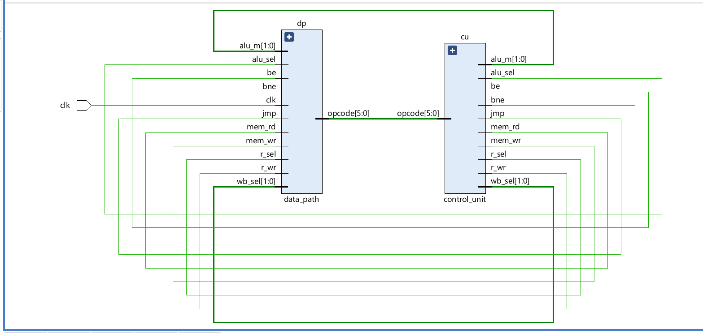

# Single-Cycle RISC Processor (Verilog)

An implementation of a custom 32-bit single-cycle RISC processor designed in Verilog and simulated using Xilinx Vivado. This processor supports basic arithmetic, logic, memory, and branching operations with a fixed instruction format and unified memory.

---

## Features

- **Instruction Format**: 32-bit fixed format.
- **Registers**: 32 General Purpose Registers (GPRs), 16-bit wide.
- **Memory**: 128KB instruction and data memory (16-bit words).
- **Supported Operations**:
  - Arithmetic: ADD, SUB
  - Logical: AND, OR, XOR, NOT
  - Shift: SHL, SHR
  - Memory: Load, Store
  - Branching: BEQ, BNE, JUMP
  - Data Transfer: MOV, MOVI
- **ALU**: Fully integrated with control decoding logic.
- **Control Unit**: Hardcoded using opcode decoding and select logic.
- **Modular Design**: Includes datapath, control unit, ALU, memory modules, and testbench.

---

## File Overview

| File                   | Description                            |
|------------------------|----------------------------------------|
| `risc.v`               | Top-level module                       |
| `data_path.v`          | Full datapath logic                    |
| `control_unit.v`       | Opcode to control signal decoding      |
| `GPRs.v`               | General Purpose Register file          |
| `Data_Memory.v`        | 64KB unified memory module             |
| `Instruction_Memory.v` | ROM for instructions (loads `.prog`)   |
| `ALU.v`                | Arithmetic and logic unit              |
| `alu_control.v`        | ALU control decoder                    |
| `testbench.v`          | Verilog testbench with waveform output |

---

## Simulation & Test

To run:

1. Launch **Xilinx Vivado** and create a new simulation project.
2. Add all source and testbench `.v` files.
3. Ensure the instruction memory file (`test.prog`) is placed in the correct path.
4. Run behavioral simulation and view waveforms to verify functionality.

---

## Control Unit Signals

| Opcode   | Instruction           | r_sel | wb_sel | alu_m | jmp | be | bne | mem_rd | mem_wr | alu_sel | r_wr |
|----------|------------------------|--------|--------|--------|------|-----|------|----------|----------|----------|-------|
| 000000   | Load (Memory Read)     | 0      | 01     | 10     | 0    | 0   | 0    | 1        | 0        | 1        | 1     |
| 000001   | Store (Memory Write)   | 0      | 00     | 10     | 0    | 0   | 0    | 0        | 1        | 1        | 0     |
| 000010   | Move (Reg → Reg)       | 1      | 10     | 10     | 0    | 0   | 0    | 0        | 0        | 0        | 1     |
| 000011   | Move Immediate         | 1      | 11     | 10     | 0    | 0   | 0    | 0        | 0        | 0        | 1     |
| 000100   | ADD                    | 1      | 00     | 00     | 0    | 0   | 0    | 0        | 0        | 1        | 1     |
| 000101   | SUB                    | 1      | 00     | 00     | 0    | 0   | 0    | 0        | 0        | 1        | 1     |
| 000110   | NOT                    | 1      | 00     | 00     | 0    | 0   | 0    | 0        | 0        | 1        | 1     |
| 000111   | SHL (Shift Left)       | 1      | 00     | 00     | 0    | 0   | 0    | 0        | 0        | 1        | 1     |
| 001000   | SHR (Shift Right)      | 1      | 00     | 00     | 0    | 0   | 0    | 0        | 0        | 1        | 1     |
| 001001   | AND                    | 1      | 00     | 00     | 0    | 0   | 0    | 0        | 0        | 1        | 1     |
| 001010   | OR                     | 1      | 00     | 00     | 0    | 0   | 0    | 0        | 0        | 1        | 1     |
| 001011   | XOR                    | 1      | 00     | 00     | 0    | 0   | 0    | 0        | 0        | 1        | 1     |
| 001100   | SLT (Set Less Than)    | 1      | 00     | 00     | 0    | 0   | 0    | 0        | 0        | 1        | 1     |
| 001101   | BEQ (Branch if Equal)  | 0      | 00     | 01     | 0    | 1   | 0    | 0        | 0        | 0        | 0     |
| 001110   | BNE (Branch Not Equal) | 0      | 00     | 01     | 0    | 0   | 1    | 0        | 0        | 0        | 0     |
| 001111   | JUMP                   | 0      | 00     | 00     | 1    | 0   | 0    | 0        | 0        | 0        | 0     |

---

## ALU Control Unit

| alu_m | Opcode    | alu_control_in | ALU Operation       | alu_cnt |
|-------|-----------|----------------|----------------------|---------|
| 00    | 000100    | 00000100       | ADD                  | 0000    |
| 00    | 000101    | 00000101       | SUB                  | 0001    |
| 00    | 000110    | 00000110       | NOT                  | 0010    |
| 00    | 000111    | 00000111       | SHL                  | 0011    |
| 00    | 001000    | 00001000       | SHR                  | 0100    |
| 00    | 001001    | 00001001       | AND                  | 0101    |
| 00    | 001010    | 00001010       | OR                   | 0110    |
| 00    | 001011    | 00001011       | XOR                  | 0111    |
| 00    | 001100    | 00001100       | SLT                  | 1000    |
| 01    | xxxxxx    | 01xxxxxx       | BEQ/BNE comparison   | 0001    |
| 10    | xxxxxx    | 10xxxxxx       | Memory address calc  | 0000    |
| 11    | xxxxxx    | 11xxxxxx       | MOVE immediate       | 1001    |

---

## Instruction Formats

### M-Type (Memory Access)

| Field        | Op (6) | Rt (5) | Rs (5) | Offset / Immediate (16) |
|--------------|--------|--------|--------|--------------------------|
| Bit Range    | 31–26  | 25–21  | 20–16  | 15–0                     |

- `000000`: Load → `Rt ← Mem[Rs + offset]`
- `000001`: Store → `Mem[Rs + offset] ← Rt`

---

### R-Type (Arithmetic/Logical)

| Field        | Op (6) | Rd (5) | Rs (5) | Rb (5) | Unused (11) |
|--------------|--------|--------|--------|--------|--------------|
| Bit Range    | 31–26  | 25–21  | 20–16  | 15–11  | 10–0         |

- Opcodes: ADD, SUB, NOT, SHL, SHR, AND, OR, XOR, SLT

---

### MOV (Register-to-Register)

| Field        | Op (6) | Rd (5) | Rs (5) | Unused (16) |
|--------------|--------|--------|--------|--------------|
| Bit Range    | 31–26  | 25–21  | 20–16  | 15–0         |

- `000010`: MOV → `Rd ← Rs`

---

### I-Type (MOVI - Move Immediate)

| Field        | Op (6) | Rd (5) | Immediate (16) | Unused (5) |
|--------------|--------|--------|----------------|------------|
| Bit Range    | 31–26  | 25–21  | 20–5           | 4–0        |

- `000011`: MOVI → `Rd ← Immediate`

---

### Branch (BEQ / BNE)

| Field        | Op (6) | Rs (5) | Rt (5) | Offset (16) |
|--------------|--------|--------|--------|--------------|
| Bit Range    | 31–26  | 25–21  | 20–16  | 15–0         |

- `001101`: BEQ if `Rs == Rt`
- `001110`: BNE if `Rs ≠ Rt`

---

### Jump Instruction

| Field        | Op (6) | Jump Address (16) | Unused (10) |
|--------------|--------|-------------------|-------------|
| Bit Range    | 31–26  | 25–10             | 9–0         |

- `001111`: JUMP → PC ← Address

---

## Schematic

